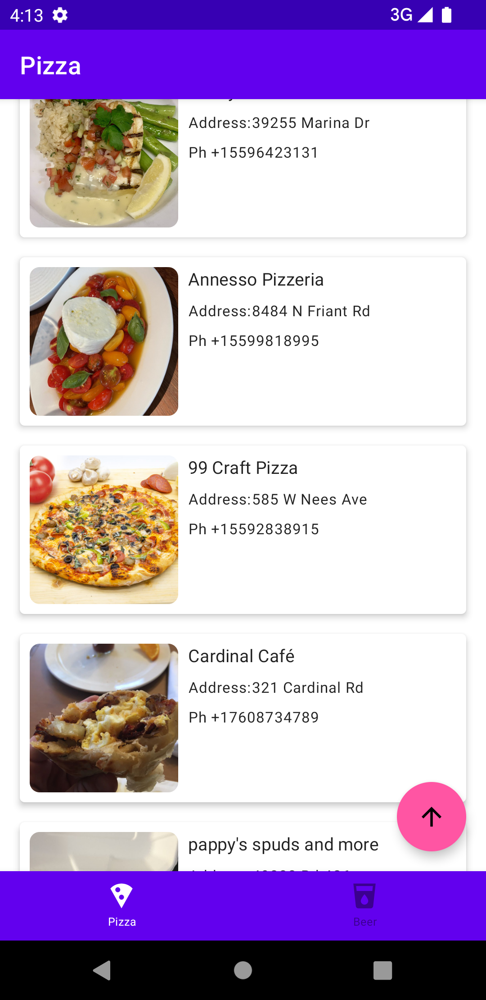
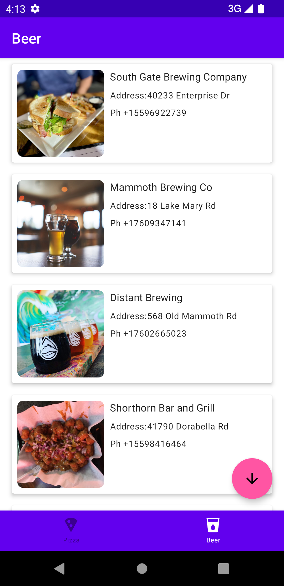
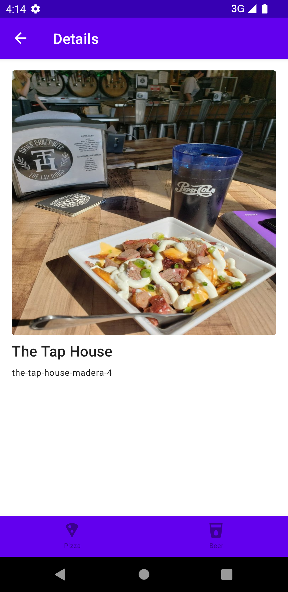

# Live search with compose
Sample app to perform live search in compose.

Happy coding (•̀ᴗ•́)و ̑̑

### Pizza Screen

### Beer Screen

### Detail Screen

## Android Libraries
1. Jetpack Compose (Google UI)
2. Dagger Hilt (Dependency Injection)
3. Retrofit (REST API) - https://www.giantbomb.com/api/documentation/#toc-0-16
4. Coil (Image Rendering)
5. Kotlin Coroutines for Async work

